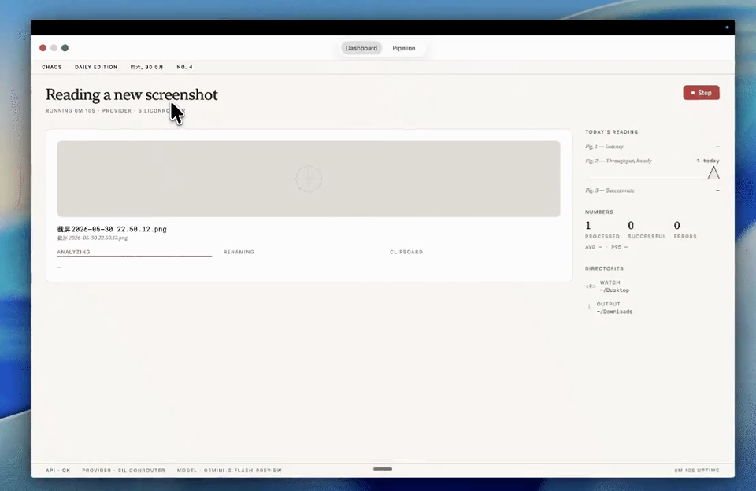

<p align="center">
  
</p>

<h1 align="center">Chaos</h1>

<p align="center">
  <strong>Turn a desktop full of anonymous screenshots into a searchable archive.</strong>
</p>

<p align="center">
  A native macOS menu bar app that watches for screenshots, asks a vision model what they contain,<br>
  and files them under useful names while you keep working.
</p>

<p align="center">
  
  
  
</p>

<p align="center">
  <code>Screenshot 2026-05-30 at 14.23.45.png</code> → <code>terminal-git-log_143022.png</code>
</p>

<p align="center">
  <a href="docs/demo.mp4">
    
  </a>
</p>

<p align="center">
  <strong><a href="docs/demo.mp4">Watch the 29-second demo →</a></strong>
</p>

## Your screenshots should not become a second inbox

Screenshots are effortless to capture and surprisingly painful to retrieve. A week later, the image you need is buried among dozens of files named with timestamps and nothing else.

Chaos quietly fixes that as the files arrive:

- **Names screenshots by meaning** using your chosen vision model
- **Files them automatically** into an output folder, with optional daily or monthly subfolders
- **Accepts existing images** through drag and drop when your backlog needs attention
- **Keeps a searchable local history** of recent processing, including failures and retries
- **Stays out of the way** in the menu bar until you need it

## Install

### Download the app (no Terminal needed)

1. Download the latest **[Chaos.dmg](https://github.com/michaelmjhhhh/Chaos/releases/latest/download/Chaos.dmg)** (or browse all [Releases](https://github.com/michaelmjhhhh/Chaos/releases/latest)).
2. Open the DMG and drag **Chaos** into your **Applications** folder.
3. The first time you open it, macOS shows a warning that it "could not verify"
   the developer. This is expected — Chaos is open source and ad-hoc signed, but
   not notarized by Apple. To open it once:
   - Double-click **Chaos** (it gets blocked the first time — that's fine).
   - Open **System Settings → Privacy & Security**, scroll to the bottom, and
     click **Open Anyway** next to the message about Chaos.
   - Click **Open** to confirm. You only do this once.

### Homebrew (for developers)

```bash
brew tap michaelmjhhhh/chaos
brew install --cask chaos
```

> [!NOTE]
> Chaos supports Apple Silicon Macs running macOS 15 or later. Because it isn't
> notarized by Apple, the one-time **Open Anyway** step above is needed on first
> launch — it is not required again after that.

## Start filing

1. Open **Settings** with `Cmd+,`.
2. Choose a provider and enter an API key if it requires one.
3. Pick the folder to watch and the folder where renamed images should land.
4. Select **Start Watching** on the dashboard.
5. Take a screenshot. Chaos names and files it automatically.

Need to clean up an existing image? Drop a PNG, JPEG, HEIC, or WebP onto the dashboard and it enters the same filing flow.

## Built for the way screenshots accumulate

| Capability | What it gives you |
| --- | --- |
| **AI-generated names** | Files you can recognize in Finder and find with Spotlight |
| **Filename templates** | A consistent format using `{slug}`, `{date}`, and `{time}` |
| **Automatic organization** | Optional day or month folders without manual sorting |
| **Local history** | The latest 500 attempts, searchable across launches |
| **Retry flow** | A quick way to reprocess failed images after fixing a provider or file issue |
| **Clipboard handoff** | An option to copy the renamed image back to your clipboard |
| **Screenshot guards** | Processing limited to new macOS screenshots when folder watching is active |
| **Editorial dashboard** | Live progress, recent filings, latency, throughput, and success rate |

## Bring your preferred model

Chaos speaks the OpenAI-compatible vision API format, so you can choose the service that fits your workflow.

| Provider | Default model | Base URL |
| --- | --- | --- |
| **SiliconRouter** | `gemini-3-flash-preview` | `https://api.siliconrouter.com/v1` |
| **OpenAI** | `gpt-4o-mini` | `https://api.openai.com/v1` |
| **DeepSeek** | `deepseek-v4-flash` | `https://api.deepseek.com` |
| **OpenRouter** | `openai/gpt-4o-mini` | `https://openrouter.ai/api/v1` |
| **OpenAI-Compatible** | `gpt-4o-mini` | You provide the URL |
| **Ollama** | `qwen3-vl:2b` | `http://localhost:11434/v1` |

### Local Ollama

Chaos connects to Ollama as an optional local provider; it does not bundle or
manage the Ollama runtime. Install and start Ollama separately, then pull the
default lightweight vision model. `qwen3-vl` requires Ollama `0.12.7+`.

```bash
ollama pull qwen3-vl:2b
```

Select **Ollama** in Chaos Settings. No API key is required.

## How it works

```text
New screenshot
      │
      ▼
ScreenshotGuard ── rejects unrelated files
      │
      ▼
VisionAPIClient ── asks your configured model for a short description
      │
      ▼
SlugSanitizer ─── makes the result filesystem-safe
      │
      ▼
FileRenamer ───── applies your template, avoids collisions, and files the image
```

Existing files in the watched directory are ignored. Chaos only processes screenshots created after the watcher starts. Images you explicitly drop onto the dashboard bypass the screenshot filename guard and enter the same naming pipeline.

## Build from source

```bash
swift build
./build-app.sh
open .build/Chaos.app
```

Requires macOS 15 or later and Swift 6.0 or later.

## Configuration

Chaos stores its configuration at:

```text
~/Library/Application Support/chaos/config.json
```

On first launch, Chaos imports an existing `vibe-shot` CLI configuration when one is available.
